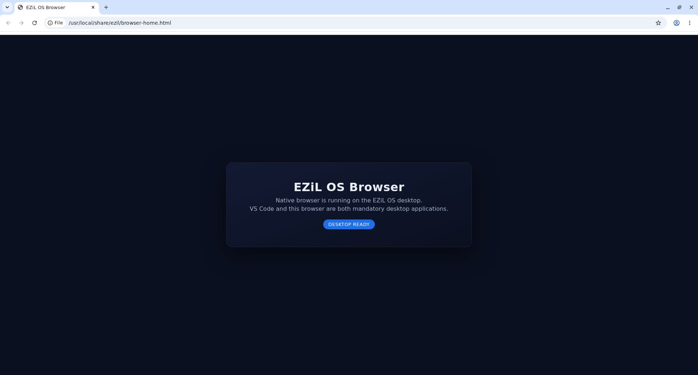
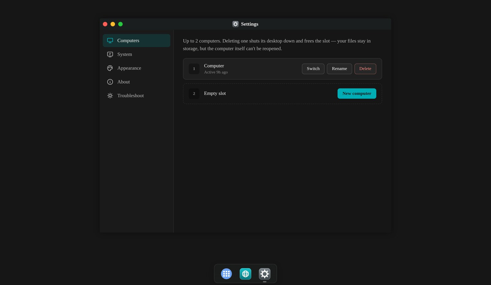

<div align="center">

<h3 align="center">EZiL-OS</h3>
  <p align="center">
    <strong>A real Linux computer, running in your browser.</strong>
    <br />
    Not a mockup and not a simulation — an actual sandboxed computer with a real
    filesystem, real processes, a real browser and a real editor, that boots on
    demand and picks up where you left it.
    <br />
    <br />
    <a href="docs/PLATFORM-NOTES.md"><strong>→ Read the platform notes</strong></a>
    <br />
    <br />
    <a href="docs/RUNBOOK.md">Runbook</a>
    ·
    <a href="https://github.com/EZiLHQ/ezil-os/issues/new?labels=bug&template=bug_report.yml">Report Bug</a>
    ·
    <a href="https://github.com/EZiLHQ/ezil-os/issues/new?labels=enhancement&template=feature_request.yml">Request Feature</a>
  </p>

[![CI][ci-shield]][ci-url]
[![License: AGPL-3.0][license-shield]][license-url]
[![Stars][stars-shield]][stars-url]
[![Issues][issues-shield]][issues-url]

</div>

> **Status: deployed and live, and you should treat it as alpha.** Everything
> here is the real thing that runs in production — but the hosted product is
> **invite-only** while it is in this state, and the whole stack needs your
> own Cloudflare, Vercel and Supabase accounts to stand up, so cloning it for
> the hosted path gets you a codebase to read and build against, not a
> one-command demo. If you just want a real desktop today with none of that,
> **[local mode](docs/LOCAL-MODE.md)** needs only Docker and Bun — no
> Cloudflare, no Vercel, no Supabase, no account. See
> [Prerequisites](#prerequisites) before you start with the hosted path.

# An open-source Linux desktop, streamed from a real container

Every user gets their own sandboxed Ubuntu container running
[Google Chrome](ATTRIBUTIONS.md) and
[code-server](https://github.com/coder/code-server) against a persistent
workspace, streamed to any browser over WebRTC or HTML5. It is built for
freelancers and independent professionals doing real work: a computer you sign
into from any tab, rather than a box tied to one desk.

## What you can do with EZiL-OS

- [x] Boot a real Linux computer from a browser tab
  - [x] A real filesystem and real processes, not an emulator
  - [x] Two computers per user, enforced by a database constraint
  - [x] A persistent workspace that survives the container
- [x] Stream the desktop to any device
  - [x] [Neko](https://github.com/m1k1o/neko) over WebRTC — the configured default
  - [x] [Apache Guacamole](https://guacamole.apache.org/) over an HTML5 tunnel
  - [x] Phone and tablet layouts, touch input and window stacking
  - [ ] A soft keyboard that survives predictive text on every mobile keyboard
        — _in progress on `wip/mobile-keyboard`_
- [x] Work inside it
  - [x] Chrome, running as a real desktop application
  - [x] code-server (VS Code) against the same workspace
  - [x] Reach an in-container dev server at its own signed, expiring URL
  - [ ] Share a desktop, or work in one together
- [x] Know what is actually happening
  - [x] Named boot phases, surfaced as they happen
  - [x] An explicit "we don't know" instead of a false "ready"
  - [x] Crash telemetry with a closed event taxonomy and no identities
- [x] Build on it
  - [x] A typed client — [`sdk/`](sdk/README.md)
  - [x] An optional MCP connector — [`mcp/`](mcp/README.md)
  - [ ] Both published to npm
- [x] Run it anywhere
  - [x] Runs on your own machine — Docker and Bun, no Cloudflare account, no
        sign-in ([`docs/LOCAL-MODE.md`](docs/LOCAL-MODE.md))
  - [x] Signed images on GHCR — keyless cosign signature plus build provenance
  - [x] CI on Linux, Windows and macOS

## Getting Started

### Run it locally

The fastest way to see a real desktop with no accounts at all:

```bash
bun install --cwd local
bun run --cwd local doctor
bun run --cwd local start
```

Then open `http://127.0.0.1:7080/os`. See
[`docs/LOCAL-MODE.md`](docs/LOCAL-MODE.md) for the environment variables, the
port map, what the doctor checks, and what is (and is not) proven about it.
The rest of this section is about the hosted path, which needs real cloud
accounts.

### Prerequisites

Be honest with yourself about this list before cloning. Without all of it you
can build, typecheck and test every piece — but you cannot boot a real desktop.

- [Bun](https://bun.sh/) and Node.js 22
- [Docker](https://www.docker.com/), to build and run the container image
- A **Cloudflare** account with Containers, Durable Objects and R2 access
- A **Vercel** project, for the Next.js app
- A **[Supabase](https://supabase.com/)** project, for Postgres and auth

### Usage

Three independent pieces, each with its own dependencies.

**The Worker** — the Cloudflare Worker and the container image it drives:

```bash
cd worker
bun install
bun run dev          # wrangler dev, local Worker + container
bun run typecheck
bun run test
```

**The app** — the Next.js front door. Copy `app/.env.example` to `.env.local`
first; `app/src/env.ts` validates the full set at boot and fails loudly if one
is missing.

```bash
cd app
bun install
bun run dev          # next dev
bun run typecheck
bun run lint
bun run test
bun run build        # run this before a PR that touches app/
```

Signed in, this is what you get: a desktop with its own windows, dock and
settings, drawn entirely by the `shell/` bundle. Every computer is a real
container, and a user may hold two.



**The shell** — the in-browser desktop UI, built into a committed bundle:

```bash
shell/build-shell.sh          # builds app/public/os/bundle.min.js
shell/build-shell.sh --check  # verify it is up to date, write nothing
```

**The SDK and the MCP connector** — neither is required to run EZiL-OS:

```bash
cd sdk && bun install && bun run typecheck && bun test
cd mcp && bun install && bun run typecheck && bun test
```

## How it works

1. You sign in to the Next.js app, which owns the product surface and keeps its
   data in Supabase Postgres.
2. `/os` renders exactly one real page, whose entire job is to paint the
   `shell/` bundle fast and hand it a boot payload.
3. From then on the shell talks to the Cloudflare Worker, which dispatches to a
   per-sandbox **Durable Object**.
4. That object starts or reconnects to a **Container** through the Cloudflare
   Sandbox SDK — a real Ubuntu box running Xvfb, a window manager, Chrome and
   code-server.
5. The desktop reaches your browser as **Neko over WebRTC** (the default) or
   through an **Apache Guacamole** HTML5 tunnel.
6. The Worker separately brokers signed, short-lived hostnames for the dev
   server and code-server inside that same container, so a web app you are
   building is reachable directly and not only through the streamed screen.
7. The workspace is **hydrated from R2 at boot and flushed back as it changes**.

**Access to the hosted product is invite-only.** Signing in requires an
invitation — today at `https://ezil-os.vercel.app`; `os.ezil.work` is the
canonical host but its DNS cutover is still pending, see
[`docs/RUNBOOK.md`](docs/RUNBOOK.md). The gate itself is an authorization
check rather than a signup switch — the Supabase project is shared with
`app.ezil.work`, where
builders must keep signing up, and anyone holding the public anon key can
create a user directly regardless of any signup form. So the check lives
where authorization already lives: one context
(`app/src/server/api/trpc.ts`'s `protectedProcedure`) plus the three page
gates, all reading the same `ezil_os_access` allow-list. Every `/api/shell/*`
route and the bearer path resolve through that same context, so the SDK and
the MCP connector are gated with no extra code. `tools/invite.ts` is the only
sanctioned way onto the allow-list. Local mode has no login, no Supabase and
no gate of any kind.

🔴 **The workspace is not an R2 mount, and that is the most expensive thing this
project learned.** `/workspace` is plain container disk. Mounting R2 through
`sandbox.mountBucket()`/s3fs silently drops **every second write** — 0 bytes,
with no error a shell redirection would ever see. The measurement is in
[`docs/PLATFORM-NOTES.md`](docs/PLATFORM-NOTES.md) §1; the replacement is
`worker/src/workspace-persist.ts`.

### Known constraints — design around these, they are not bugs

- **TURN relay is the latency floor.** Cloudflare Containers expose no UDP, so
  both WebRTC peers relay. The HTTP preview bridge is lower-latency than the
  streamed desktop for anything renderable as a web page.
- **No GPU.** All rendering and encoding is software, competing with the compiler.
- **Containers can vanish without notice.** Persistence stays eager; the flush
  interval is the design response.
- **`/os` first paint has a ~400-650ms floor**, not the sub-200ms this project
  informally aimed at. A protected page must verify the session before it can
  decide to render, and that decision is on the critical path. Measured, not
  estimated — treat a number in that range as success.

### Our tech stack

**Front end**

- [Next.js](https://nextjs.org/) — the app shell and API routes
- [tRPC](https://trpc.io/) — the typed server interface
- Vanilla JS — the desktop UI, a modified fork of [Puter](https://github.com/HeyPuter/puter)

**Data**

- [Supabase](https://supabase.com/) — Postgres and auth
- [Drizzle](https://orm.drizzle.team/) — ORM and migrations

**Sandbox and streaming**

- [Cloudflare Sandbox SDK](https://developers.cloudflare.com/cloudflare-for-platforms/cloudflare-sandbox/) — containers, Durable Objects, R2
- [Neko](https://github.com/m1k1o/neko) — WebRTC desktop streaming
- [Apache Guacamole](https://guacamole.apache.org/) — HTML5 desktop streaming
- [code-server](https://github.com/coder/code-server) — VS Code in the browser

**Runtime**

- [Bun](https://bun.sh/) — package manager, test runner
- [Docker](https://www.docker.com/) — the container image

## Repository layout

```text
.
├── worker/  # Cloudflare Worker (Durable Objects + R2) and the container image:
│            #   Neko/Guacamole streaming, code-server, the app preview bridge
├── app/     # Next.js app: auth, the "your computers" list, the /os host page
├── shell/   # The in-browser desktop UI, built into app/public/os/bundle.min.js
├── sdk/     # @ezil-os/sdk — a typed client for the computer API
├── mcp/     # @ezil-os/mcp — an optional MCP connector over that SDK
├── local/   # The local-mode host: no Cloudflare, drives Docker directly
├── docker/  # The neko/code-server base image build inputs (pinned upstream SHAs)
├── deploy/  # The pinned image reference (images.env) and the release launcher
├── tools/   # Repo-wide scripts: the invite CLI, the plan/ledger tooling, test.sh
├── docs/    # Platform notes, the runbook, telemetry, design records
└── e2e/     # Production suites: real sign-in, real container, live deployment
```

`mcp/` is a **connector, not a component**: nothing in `worker/`, `app/` or
`shell/` imports it, and EZiL-OS runs identically if you delete the directory.

## Documentation

- **[`docs/LOCAL-MODE.md`](docs/LOCAL-MODE.md)** — running a real desktop on
  your own machine: prerequisites, the environment variables, the port map,
  the doctor, what is proven about it and how, and troubleshooting.
- **[`docs/PLATFORM-NOTES.md`](docs/PLATFORM-NOTES.md)** — everything learned the
  hard way about Cloudflare Containers/Workers, Vercel and this stack's sharp
  edges. Read it before assuming a primitive behaves the way its docs imply.
- **[`docs/RUNBOOK.md`](docs/RUNBOOK.md)** — what is live, how to operate it,
  known constraints and open items.
- **[`docs/telemetry.md`](docs/telemetry.md)** — the exact, code-linked account
  of what is collected. Designed in
  [`docs/telemetry-design.md`](docs/telemetry-design.md).
- **[`docs/NEKO-GROUND-TRUTH.md`](docs/NEKO-GROUND-TRUTH.md)** — what a real
  container actually does, established by running one and photographing it. The
  screenshots are committed, so every claim can be checked against the pixels.
- **[`docs/PERFORMANCE-BASELINE.md`](docs/PERFORMANCE-BASELINE.md)** — where the
  time goes, measured against live production, with its own limits stated up front.
- **[`docs/research/local-agents.md`](docs/research/local-agents.md)** — a
  measured survey of computer-use drivers against a local desktop, and what
  GPU passthrough would need. Research only; nothing here is built yet.
- **[`GOVERNANCE.md`](GOVERNANCE.md)** — how decisions get made, who can merge,
  and how somebody outside the project becomes somebody inside it.
- **[`ROADMAP.md`](ROADMAP.md)** — what the project is trying to become, item
  by item, with the measurement that would settle whether each one is real.
- **[`docs/ORCHESTRATION.md`](docs/ORCHESTRATION.md)** and
  **[`docs/ORCHESTRATION-LOG.md`](docs/ORCHESTRATION-LOG.md)** — how the
  automated workers referenced in [Contributing](#contributing) below are
  planned and what they actually did, down to the run artifact.

## Telemetry

EZiL-OS collects crash and error telemetry from signed-in sessions — never
identities, file contents, secrets or full URLs.
**[`docs/telemetry.md`](docs/telemetry.md)** is the exact account of what is
collected, what deliberately is not, how long it is kept, and how to stop it
reaching this repository's servers at all.

## Security

Please report vulnerabilities **privately** — never as a public issue. See
[`SECURITY.md`](SECURITY.md) for the reporting route, the scope, and the design
decisions that look like bugs but are not.

## Contributing

Suggestions and pull requests are welcome. Fork the repository and open a PR, or
[open an issue](https://github.com/EZiLHQ/ezil-os/issues).

Read [`CONTRIBUTING.md`](CONTRIBUTING.md) first — it covers the DCO sign-off
every commit needs, the build and test commands per package, and two rules this
project enforces in CI because breaking them has taken the desktop down before.
Conduct expectations are in [`CODE_OF_CONDUCT.md`](CODE_OF_CONDUCT.md), and how
decisions get made — including how you become a collaborator — is
[`GOVERNANCE.md`](GOVERNANCE.md).

**`main` is protected**: every change lands by pull request, with a DCO
sign-off on every commit and CI green on Linux, Windows and macOS before it
can merge — including from a maintainer, who cannot approve their own PR
either (see `GOVERNANCE.md`'s "Merging into `main`" for why the required
approval count is zero rather than bypassed).

#### Contributors

<a href="https://github.com/EZiLHQ/ezil-os/graphs/contributors">
  
</a>

## Contact

- Security: [security@ezil.work](mailto:security@ezil.work) — see [`SECURITY.md`](SECURITY.md)
- General: [contact@ezil.work](mailto:contact@ezil.work)
- Project: [github.com/EZiLHQ/ezil-os](https://github.com/EZiLHQ/ezil-os)

## License

Distributed under the **GNU Affero General Public License v3.0**. See
[`LICENSE`](LICENSE) for the full text.

In practice:

- **You can** use, study, modify and redistribute this code, for free, including
  commercially.
- **If you run a modified version as a network service**, AGPL-3.0 requires you
  to make your modified source available to that service's users. This is the
  key difference from a plain GPL or a permissive license — it applies even if
  you never distribute a binary.
- **Contributions** are accepted under the same terms (see
  [`CONTRIBUTING.md`](CONTRIBUTING.md)).

This is not legal advice; read the [full license](LICENSE) or talk to a lawyer
if you have a specific redistribution or hosting scenario in mind.

## Built on the work of

EZiL-OS did not start from a blank slate. The streamed-desktop backend builds on
Apache Guacamole, Neko, code-server/VS Code, Google Chrome and the Cloudflare
Sandbox SDK. The desktop UI in `shell/` is a **modified fork of
[Puter](https://github.com/HeyPuter/puter)** (AGPL-3.0) — genuinely forked code,
not an influence — tracked file-by-file in
[`shell/PUTER-PROVENANCE.md`](shell/PUTER-PROVENANCE.md). The project's
architectural lineage also traces back through an earlier prototype built on
**[Onlook](https://github.com/onlook-dev/onlook)** (Apache-2.0); no Onlook code
is present in this repository, and it is credited voluntarily.

Some source comments cite **EBuilder** as the origin of a file. EBuilder is
EZiL's separate, unreleased visual-builder project, where a few of these modules
were written before EZiL-OS was split into its own repository. Those citations
are provenance, kept deliberately so every carried file says where it came from.

**Every upstream project this repository uses, its license, and exactly what it
is used for is documented in [`ATTRIBUTIONS.md`](ATTRIBUTIONS.md).** If you are
evaluating this project for redistribution or compliance, start there.

<!-- reference-style links -->

[ci-shield]: https://img.shields.io/github/actions/workflow/status/EZiLHQ/ezil-os/ci.yml?branch=main&style=for-the-badge&label=CI
[ci-url]: https://github.com/EZiLHQ/ezil-os/actions/workflows/ci.yml
[license-shield]: https://img.shields.io/badge/License-AGPL--3.0-blue.svg?style=for-the-badge
[license-url]: https://github.com/EZiLHQ/ezil-os/blob/main/LICENSE
[stars-shield]: https://img.shields.io/github/stars/EZiLHQ/ezil-os.svg?style=for-the-badge
[stars-url]: https://github.com/EZiLHQ/ezil-os/stargazers
[issues-shield]: https://img.shields.io/github/issues/EZiLHQ/ezil-os.svg?style=for-the-badge
[issues-url]: https://github.com/EZiLHQ/ezil-os/issues
